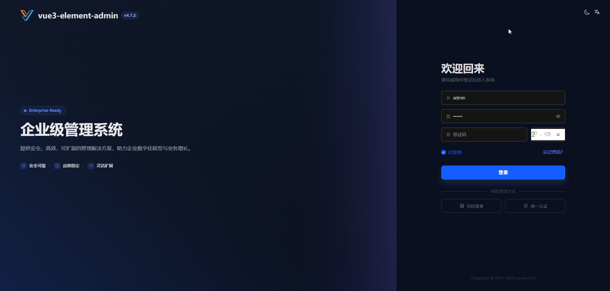
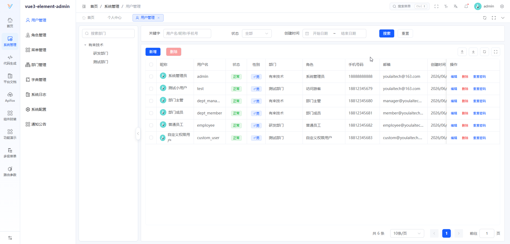

<div align="center">

#  youlai-fastapi


**FastAPI 企业级权限管理系统后端（Python）**

[](https://fastapi.tiangolo.com/)
[](https://www.python.org/)
[](https://www.postgresql.org/)
[](https://redis.io/)
[](LICENSE)
[](https://gitee.com/youlaiorg/youlai-fastapi/stargazers)
[](https://github.com/youlaitech/youlai-fastapi)

</div>


<div align="center">

[](https://vue.youlai.tech)
[](https://app.youlai.tech)
[](https://www.youlai.tech/docs/server/spring-boot/)
[](./README.en.md)

</div>

## 项目简介

**youlai-fastapi** 是一套基于 Python（FastAPI + SQLAlchemy 2.0 + PostgreSQL）的企业级权限管理系统后端，配套前端 [vue3-element-admin](https://gitee.com/youlaiorg/vue3-element-admin) 和移动端 [youlai-app](https://gitee.com/youlaiorg/youlai-app)，并提供 **7 种语言实现**（Java / Node.js / Go / Python / PHP / C# / Rust），共享同一套 API 规范与数据库结构。适用于 Python 技术栈团队的企业中后台学习与二次开发。完整接口文档见 [Apifox](https://www.apifox.cn/apidoc/shared-195e783f-4d85-4235-a038-eec696de4ea5)。

## 核心特性

- 🔐 **安全体系** — PyJWT + bcrypt + Redis Token，支持令牌签发、续期与多端会话
- 🛡️ **细粒度权限** — RBAC 数据 / 菜单 / 按钮 / 接口级，数据权限五档
- ⚡ **代码生成器** — 一键生成前后端 CRUD 代码（codegen 模块）
- 📦 **模块齐全** — 用户、角色、菜单、部门、字典、配置、文件、通知、操作日志
- 🌐 **多语言生态** — 与其它语言版本共享 API 规范与数据库结构
- 🔌 **实时通信** — SSE 推送：在线用户数、字典同步、通知广播

## 系统预览

**PC 端**

<table align="center">
  <tr>
    <td></td>
    <td></td>
  </tr>
  <tr>
    <td></td>
    <td></td>
  </tr>
  <tr>
    <td></td>
    <td></td>
  </tr>
</table>

**移动端**

<table align="center">
  <tr>
    <td></td>
    <td></td>
    <td></td>
    <td></td>
  </tr>
</table>

## 快速开始

**环境要求**：Python 3.11+ · PostgreSQL 16+ · Redis 7.x

1. 克隆项目：
   ```bash
   git clone https://github.com/youlaitech/youlai-fastapi.git
   ```

2. 创建虚拟环境并安装依赖（依赖清单见 `pyproject.toml`）：
   ```bash
   python -m venv .venv
   .venv\Scripts\activate      # Windows
   # source .venv/bin/activate # Linux/Mac
   pip install -e .
   ```
   > pytest / ruff 等开发工具单独装：`pip install -e ".[dev]"`

3. 创建并初始化数据库：
   ```bash
   createdb youlai_admin
   psql -d youlai_admin -f sql/postgresql/youlai-admin.sql
   ```

4. 启动服务：

   **方式一：PyCharm / VS Code 启动（推荐）**
   用 PyCharm 或 VS Code 打开项目并选中虚拟环境，运行 `app/main.py` 或 `fastapi dev` 任务即可。

   **方式二：命令行启动**
   ```bash
   fastapi dev app/main.py
   ```
   启动后访问 [http://localhost:8000/docs](http://localhost:8000/docs)，能打开接口文档即说明后端已正常运行。

5. 启动前端（可选）：
   如需可视化操作界面，启动配套前端 [vue3-element-admin](https://gitee.com/youlaiorg/vue3-element-admin)，访问 [http://localhost:3000](http://localhost:3000)，使用 `admin` / `123456` 登录。

## 目录结构

> 按业务域组织，每个域自包含 `router/schemas/models/service`，参考 [zhanymkanov/fastapi-best-practices](https://github.com/zhanymkanov/fastapi-best-practices)。

```
youlai-fastapi/
├── .env             # 数据库 / Redis 连接等运行配置
├── app/             # 应用主目录
│   ├── main.py      # FastAPI 入口
│   ├── config.py    # Pydantic Settings 配置（默认值来源）
│   ├── auth/        # 认证（登录/登出/刷新/验证码/扫码登录）
│   ├── system/      # 系统管理（用户 / 角色 / 部门 / 菜单 等）
│   └── tool/        # 工具（文件上传 / 代码生成 等）
├── alembic/         # 数据库迁移
├── tests/           # 测试
├── sql/             # 数据库初始化脚本（PostgreSQL）
└── pyproject.toml   # 依赖管理
```

## 生态矩阵

**前端**

| 项目 | 技术栈 | 说明 | 更新状态 |
|:-----|:-------|:-----|:---------|
| [vue3-element-admin](https://gitee.com/youlaiorg/vue3-element-admin) | Vue 3 + Element Plus | PC 管理前端（主推） | ✅️ |
| [youlai-app](https://gitee.com/youlaiorg/youlai-app) | Vue 3 + UniApp | 移动端 App | ✅️ |

**后端**

| 项目 | 技术栈 | 说明 | 更新状态 |
|:-----|:-------|:-----|:---------|
| [youlai-boot](https://gitee.com/youlaiorg/youlai-boot) | Spring Boot + MyBatis-Plus | Java（主推） | ✅️ |
| [youlai-nest](https://gitee.com/youlaiorg/youlai-nest) | NestJS + TypeORM | Node.js | ✅️ |
| [youlai-gin](https://gitee.com/youlaiorg/youlai-gin) | Go + Gorm | Go | ✅️ |
| [youlai-django](https://gitee.com/youlaiorg/youlai-django) | Django + DRF | Python | ✅️ |
| [youlai-fastapi](https://gitee.com/youlaiorg/youlai-fastapi) | FastAPI + SQLAlchemy | Python | ✅️ |
| [youlai-laravel](https://gitee.com/youlaiorg/youlai-laravel) | Laravel + Eloquent | PHP | ✅️ |
| [youlai-think](https://gitee.com/youlaiorg/youlai-think) | ThinkPHP + ThinkORM | PHP | ✅️ |
| [youlai-aspnet](https://gitee.com/youlaiorg/youlai-aspnet) | ASP.NET Core + EF Core | C# | ✅️ |
| [youlai-axum](https://gitee.com/youlaiorg/youlai-axum) | Axum + SeaORM | Rust | ✅️ |

> 九种后端共享同一套 **RESTful API 规范** 和 **数据库结构**，前端可无缝切换。

**变种与衍生版本**

| 项目 | 基础 | 说明 | 更新状态 |
|:-----|:-----|:-----|:---------|
| [youlai-boot-tenant](https://gitee.com/youlaiorg/youlai-boot-tenant) | youlai-boot | 多租户 SaaS，租户隔离与租户配置 | ✅️ |
| [youlai-boot-flex](https://gitee.com/youlaiorg/youlai-boot-flex) | youlai-boot | 改用 MyBatis-Flex | ✅️ |
| [youlai-boot (db-pg)](https://gitee.com/youlaiorg/youlai-boot/tree/db-pg) | youlai-boot | PostgreSQL 数据库分支 | ✅️ |
| [youlai-boot (multi-module)](https://gitee.com/youlaiorg/youlai-boot/tree/multi-module) | youlai-boot | 多模块工程拆分 | ✅️ |
| [youlai-boot (spring-boot-3)](https://gitee.com/youlaiorg/youlai-boot/tree/spring-boot-3) | youlai-boot | Spring Boot 3 兼容分支 | ✅️ |
| [youlai-nest (multi-tenant)](https://gitee.com/youlaiorg/youlai-nest/tree/multi-tenant) | youlai-nest | 多租户 SaaS，租户隔离与租户配置 | ✅️ |

## 技术合作

本项目采用 [Apache License 2.0](LICENSE) 开源，可免费商用。欢迎在 [Issue](https://gitee.com/youlaiorg/youlai-fastapi/issues) 提交问题或反馈，也欢迎提交 [Pull Request](https://gitee.com/youlaiorg/youlai-fastapi/pulls) 共建。

如需技术支持、商务合作、二次开发、项目定制或私有化部署，可联系作者微信（见下方二维码）。

<table align="center">
  <tr>
    <td align="center" width="160"><br><sub>公众号「有来技术」</sub></td>
    <td align="center" width="160"><br><sub>小程序「有来技术」</sub></td>
    <td align="center" width="160"><br><sub>添加作者微信</sub></td>
  </tr>
</table>

<p align="center"><em>技术交流 · 问题反馈 · 商务合作</em></p>
